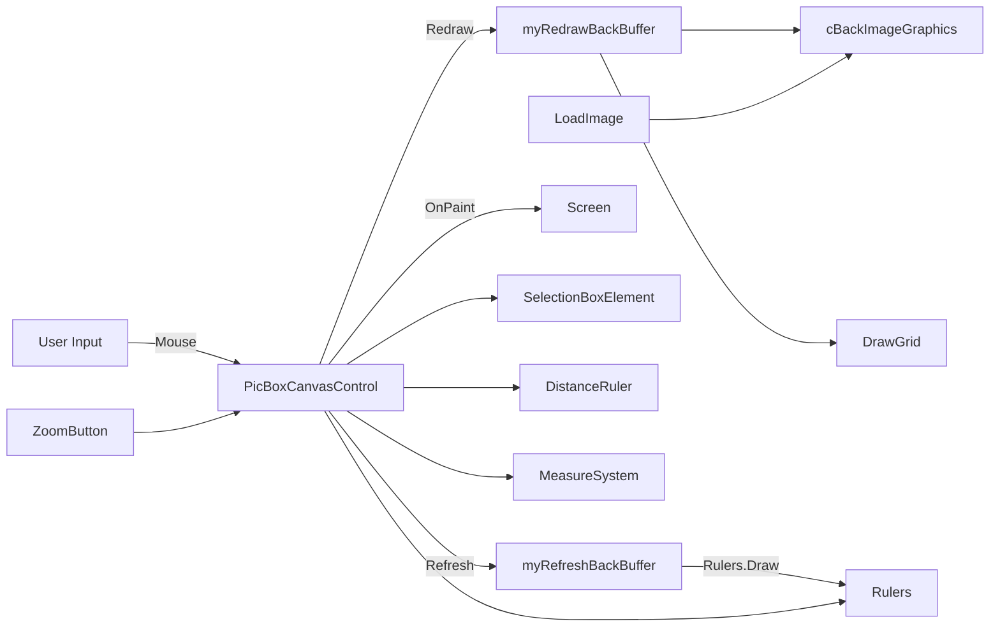

# PicBoxCanvas — System Overview & Architecture 🏗️

This document consolidates the per-file diagrams into an overall system view and provides a short contributor README to quickly understand where to make changes and how to test them.

## Big picture components
- PicBoxCanvasControl (core control)
  - Manages logical viewport, input events, double-buffered rendering, and exposes public API for zoom/pan/measure.
- Rendering pipeline
  - Redraw() → draws background image via cBackImageGraphics, grid, and static content into `myRedrawBackBuffer`.
  - Refresh() → composes `myRedrawBackBuffer` into `myRefreshBackBuffer`, draws rulers (Rulers.Draw) and invalidates.
  - OnPaint() → blits `myRefreshBackBuffer` to screen and draws transient overlays (SelectionBox, DistanceRuler, cross cursor).
- Helpers
  - ConversionInfo — coordinate transforms between physical and logical coordinates.
  - Rulers — generate ruler bitmaps (horizontal/vertical), scale-aware numeric tick generation.
  - MeasureSystem — conversion of micron/mm/inches etc.
  - DistanceRuler — interaction and drawing for the measurement tool.
  - SelectionBoxElement — selection/zoom rectangle logic.
  - ZoomButton — small UI binder for toggles & actions.

## High-level diagram

## User interaction flows (summary)
- Zoom-select: MouseDown -> SelectionBox.TopLeftCorner -> MouseMove -> update -> MouseUp -> ShowLogicalWindow(SelectionBox) -> Redraw -> Refresh -> OnPaint
- Measure distance: Set ClickAction=MeasureDistance -> MouseDown -> DistanceRuler(MouseDown) -> MouseMove -> MouseUp -> DistanceRuler(MouseUp) -> OnMeasureCompleted -> OnPaint draws overlay
- Mouse wheel: Zoom in/out near logical mouse position, respecting min/max zoom and raising events

## Contributor README (quick start) ✅
1. Open `PicBoxCanvas.sln` in Visual Studio (Windows). Build the solution.
2. Create a small WinForms app, add a project reference to this project, and drop `PicBoxCanvasControl` onto a form for manual testing.
3. Common files you'll edit by feature:
   - Viewport, input, buffer lifecycle → `PicBoxCanvasControl.vb`
   - Coordinate transforms → `ConversionInfo.vb`
   - Ruler logic, tick spacing → `Rulers.vb` and `DistanceRuler.vb`
   - Background image handling → `BackImageGraphics.vb`
   - UI bindings → `ZoomButton.vb`
   - Units & conversions → `MeasureSys.vb`
4. When modifying rendering code, measure performance: prefer reusing pens and bitmaps and avoid heavy per-frame allocations.
5. Manual test checklist: zoom & pan, resize window, toggle grid/rulers, measure distances, load background image, save screenshot.

## Files to read first (priority order)
1. `PicBoxCanvasControl.vb` (control lifecycle & events)
2. `PublicTypes.vb` (RECT / SEGMENT primitives)
3. `ConversionInfo.vb` (logical<->physical conversions)
4. `Rulers.vb` (ruler bitmaps & labels)
5. `BackImageGraphics.vb` (background image drawing)

---
