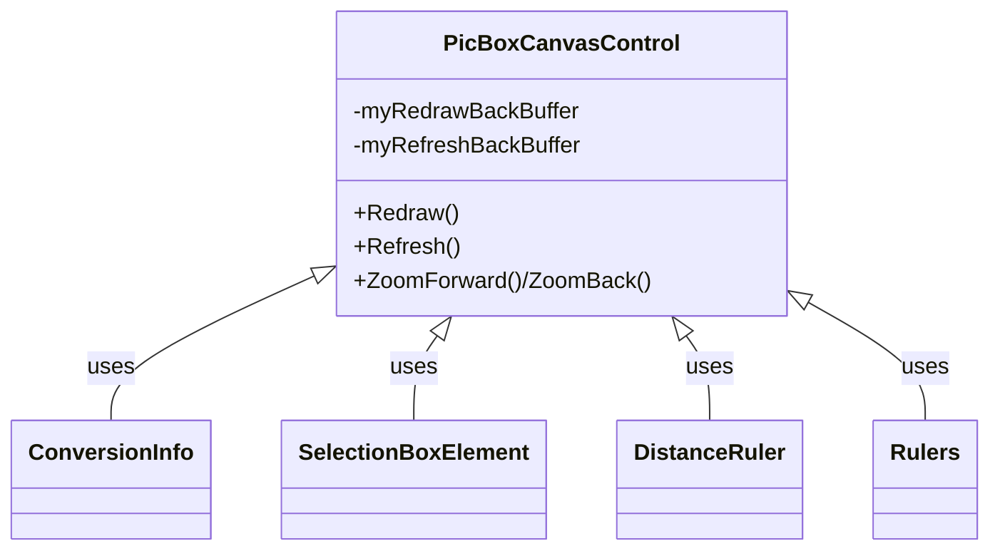
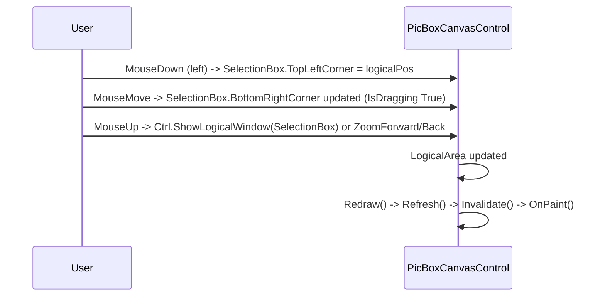
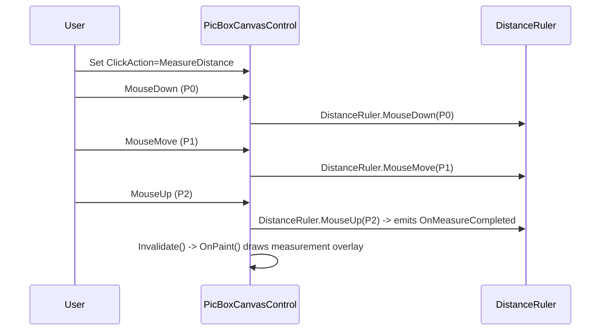

# PicBoxCanvasControl — Use Cases & Functional Requirements 🔧

Summary
- `PicBoxCanvasControl` is the central WinForms control that provides pan/zoom, measurement, grid/ruler overlays, background-image placement, selection/zoom-by-drag, and double-buffered rendering.
- Main collaborators: `ConversionInfo` (coordinate transforms), `DistanceRuler` (measurement), `SelectionBoxElement`, `Rulers`, `CoordinatesBox`, `BackImageGraphics`.

## Responsibilities
- Convert mouse/physical coordinates to logical coordinates and raise typed mouse events.
- Maintain LogicalArea / ScaleFactor and enforce Min/Max logical window sizes.
- Provide pan/zoom operations (programmatic and via user input): `ZoomForward`, `ZoomBack`, `ShowLogicalWindow`.
- Manage double-buffered drawing using two bitmaps: `myRedrawBackBuffer` (drawn during Redraw()) and `myRefreshBackBuffer` (blitted to the screen during Refresh()/OnPaint()).
- Support different click actions via `enClickAction` (`None`, `Zoom`, `MeasureDistance`) and raise relevant events (e.g., `OnMeasureCompleted`, `OnMaximumZoomLevelReached`).

## Key constants & properties (reference)
- ZoomMultiplier = 1.25 (used by ZoomForward/ZoomBack)
- PanFactorWithShift / PanFactorNoShift
- `ScaleFactor`, `LogicalOrigin`, `LogicalWidth`, `LogicalHeight`, `LogicalArea` (via `GraphicInfo`)
- `ShowRulers`, `ShowGrid`, `ShowMouseCoordinates`

## Use Cases (concise)
| Use Case | Actor | Description | Key methods/events |
|---|---|---|---|
| Zoom to point | User / App | Zoom in/out centered on a logical point | `ZoomForward(LogicalPosition)`, `ZoomBack(LogicalPosition)`
| Zoom-select region | User | Drag to draw selection box, release to zoom to that area | MouseDown->SelectionBox, MouseMove->SelectionBox, MouseUp->ShowLogicalWindow(SelectionBox)
| Measure distance | User | Switch click mode to MeasureDistance, drag to measure length/angle | `ZoomButton` toggles `ClickAction`; `DistanceRuler.MouseDown/Move/Up` | `OnMeasureCompleted`
| Render full scene | System | Rebuild draw buffers and blit to screen | `Redraw()` → `Refresh()` → `OnPaint()`
| Save screenshot | User / App | Store current visual contents to image | `GetScreenShot()`, `SaveAScreenShot()`

## Functional Requirements (FRs)
- FR-DR-01: Redraw must draw the static scene to `myRedrawBackBuffer` (background image, grid, etc.) and call `Refresh()` to compose rulers and invalidate the control.
- FR-DR-02: Refresh must copy `myRedrawBackBuffer` to `myRefreshBackBuffer` using clipped copy (`DrawImageUnscaledAndClipped`) and draw rulers then optionally `Invalidate()` to trigger OnPaint.
- FR-INP-01: Mouse input must be converted to logical coordinates using `GraphicInfo.ToLogicalPoint` before raising events.
- FR-CLICK-01: `ClickAction` state must determine behavior of MouseDown/Move/Up (Zoom vs Measure vs None). Changing `ClickAction` should raise `OnClickActionChanged(old,new)`.
- FR-BUF-01: Buffer bitmaps should be resized in `UpdateDimensions()` in 100-pixel increments to avoid thrashing (preserve performance and avoid frequent allocation).
- FR-ZOOM-01: Zoom operations must respect Min/Max logical window sizes; raise `OnMinimumZoomLevelReached`/`OnMaximumZoomLevelReached` when bounds reached.

## Behavior & State Machine (short)
- Click actions:
  - None: no special interaction.
  - Zoom: Left-drag creates `SelectionBox` (KeepAspectRatio = True during Zoom mode), release zooms into selection, single click zooms in/out depending on button.
  - MeasureDistance: left-drag feeds `DistanceRuler` (MouseDown/Move/Up) and raises `OnMeasureCompleted` when finished.

## Diagrams (small, composable)

### Component diagram

### Sequence: Zoom-select region

### Sequence: Measure distance

## Implementation notes & developer tips 💡
- Use `GetScaledGraphicObject(myRedrawBackBuffer)` to draw in logical coordinates (Scale + Translate applied).
- `Redraw()` draws static scene to `myRedrawBackBuffer`. Keep per-frame expensive allocations out of Redraw (reuse pens/brushes where possible).
- `Refresh()` composes rulers and copies into `myRefreshBackBuffer` and may call `Invalidate()` to trigger `OnPaint`.
- `OnPaint` draws `myRefreshBackBuffer` to screen and draws small overlays (selection box, distance ruler) by resetting transform and drawing in physical coords as needed.
- Be careful when changing `LogicalArea` inside resize cycles — `ResizeMode.Stretch` uses `myLastVisibleAreaRequested` to avoid losing the user's viewport.

## Manual test checklist
- Verify zoom-in/out with mouse wheel and with drag-select; ensure `OnMaximumZoomLevelReached`/`OnMinimumZoomLevelReached` fire at bounds.
- Toggle `ClickAction` between `Zoom` and `MeasureDistance` and verify correct overlays are drawn and `OnMeasureCompleted` is raised with correct logical points.
- Resize window while dragging to ensure buffers are reallocated properly and no flicker occurs.

---
