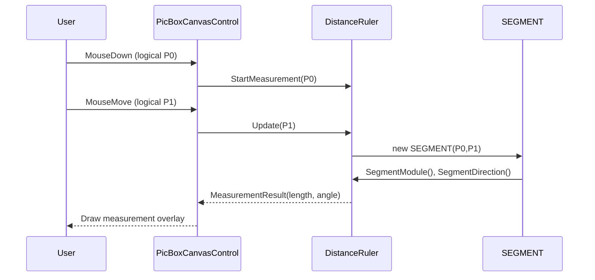

# PublicTypes.vb — Use Cases & Functional Requirements 📐

Summary
- `PublicTypes.vb` defines the fundamental data types and enums used throughout the control: geometric structs (`RECT`, `SEGMENT`) and enums (`GridKind`, `enClickAction`, `ResizeMode`). These types are the canonical representation of logical coordinates, interaction modes and primitive geometry.

Why this matters
- `RECT` is used as the canonical logical-area and bounding-box representation (used by `PicBoxCanvasControl`, `ConversionInfo`, `Cursors`, etc.).
- `SEGMENT` encapsulates two points and provides measurement helpers (module/length, direction) used by `DistanceRuler`.

---

## Key types (quick reference)
- `RECT` — fields: `left, top, right, bottom` + properties/methods: `Width/Height/CenterPoint/TopLeft/IsZeroSized/Normalize/Inflate/Offset/ToRectangle/ExpandFromFixedPoint/Union/Intersect/Contains`.
- `SEGMENT` — fields: `X0,Y0,X1,Y1` + properties: `P0,P1` + helpers: `SegmentModule(), SegmentDirection(), MediumPoint()`.
- `GridKind` — grid rendering types: `FullLines`, `Points`, `Crosses`.
- `enClickAction` — interaction mode: `None`, `Zoom`, `MeasureDistance`.
- `ResizeMode` — scaling mode: `Normal`, `Stretch`.

---

## Use Cases (concise) ✅
| Use Case | Actors | Description | Example callers |
|---|---:|---|---|
| Represent the visible logical viewport | Control | Store/display the logical area shown by the control | `PicBoxCanvasControl.LogicalArea` (type `RECT`) |
| Convert logical rects to physical screen rects | Conversion | Translate logical `RECT` to physical `RECT`/`Rectangle` for drawing | `ConversionInfo.ToPhysicalRect(LogicalRect As RECT)` |
| Measure distance/angle between two points | User + Control | Use `SEGMENT` to compute length and direction for distance ruler | `DistanceRuler` uses `SEGMENT.SegmentModule()` and `SegmentDirection()` |
| Set interaction mode | User | Toggle click behavior between zoom and measuring | `ZoomButton` toggles `LinkedPictureBox.ClickAction = enClickAction.*` |
| Render grid overlays | Control | Choose grid display type using `GridKind` property | `PicBoxCanvasControl.GridView` |

---

## Functional Requirements (FRs)
- FR-RECT-01: `RECT` must support conversion to/from `System.Drawing.Rectangle` accurately (preserve left/top/right/bottom semantics).  (See: widening operators and constructors.)
- FR-RECT-02: `RECT` must provide reliable geometric helpers: `Contains`, `IntersectsWith`, `Normalize`, `Inflate`, `Offset` to be used by hit-testing and layout code.
- FR-RECT-03: `RECT.InvalidPoint()` is the canonical sentinel for uninitialized logical origin (used by cursors, conversion). Respect it when checking state.
- FR-SEG-01: `SEGMENT` must compute length (`SegmentModule`) and direction (`SegmentDirection`) consistently with inverted Y-axis (Windows coordinates). (`SegmentDirection` contains explicit handling for quadrant logic.)
- FR-EN-01: Enums `enClickAction` and `GridKind` are small, stable API contracts used by UI and should not be renumbered or removed without compatibility consideration.

---

## Small diagrams (file-level)

### Class diagram (types & callers)
```mermaid
classDiagram
    RECT <|-- ConversionInfo : uses
    RECT <|-- PicBoxCanvasControl : stores LogicalArea
    RECT <|-- CrossCursor : stores position
    SEGMENT <|-- DistanceRuler : uses
    PicBoxCanvasControl : +LogicalArea : RECT
    ConversionInfo : +ToPhysicalRect(LogicalRect:RECT):RECT
    DistanceRuler : +Measure(p0:Point, p1:Point):Double
```

### Sequence: measure distance (user flow)


---

## Implementation notes for contributors (do's and don'ts) 🔧
- Do prefer `RECT` for logical coordinate storage and `System.Drawing.Rectangle` only for final GDI+ calls (use the widening operators). This preserves the semantic difference between inclusive left/top and exclusive right/bottom.
- Do avoid in-place floating-point handling inside `RECT` — conversions are already provided via RectangleF constructors when needed.
- Do rely on `SEGMENT.SegmentDirection()` which already accounts for the inverted Y-axis in Windows coordinate space.
- Don't change enum numeric values (binary compatibility risk); add new values if needed.

---
