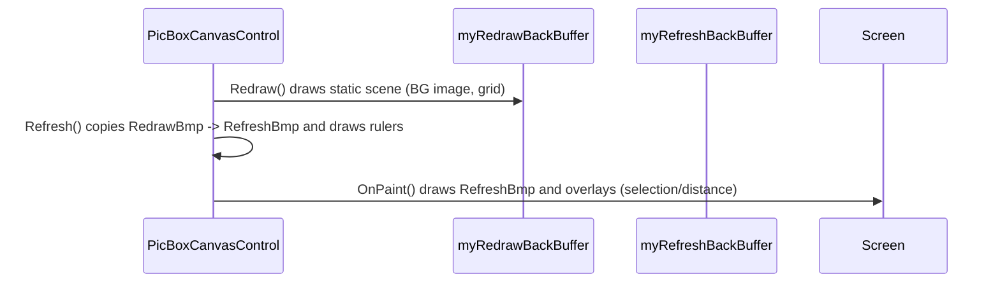

# Rendering helpers — Use Cases & Functional Requirements 🎨

This document covers three rendering-related units: `BackImageGraphics` (`BackImageGraphics.vb`), `Rulers` (`Rulers.vb`), and `MeasureSystem` (`MeasureSys.vb`). Each section contains the "why", concrete examples from the code, functional requirements, and small diagrams you can compose into the global picture.

---

## cBackImageGraphics (BackImageGraphics.vb)
What it is:
- Small helper that wraps a background bitmap and draws it at a logical origin with pixel-size scaling.

How it's used (concrete):
- Created in `PicBoxCanvasControl.Image` setter: myPictureBoxImageGR = New cBackImageGraphics(myPictureBoxImage, ImageCustomOrigin.X, ImageCustomOrigin.Y, enBitmapOriginPosition.TopLeft, myPictureBoxImagePixelSize_micron, myPictureBoxImagePixelSize_micron)
- Draw call used by control in `DrawPictureBoxImage(GR)` -> `myPictureBoxImageGR.Draw(GR)`.

Key behavior & example:
- Draw multiplies bitmap dimensions by PixelWidth (and PixelHeight) when computing destination rectangle:
  GR.DrawImage(BitmapImage, New Rectangle(Origin.X, Origin.Y, BitmapImage.Width * PixelWidth, BitmapImage.Height * PixelWidth), ...)
- `enBitmapOriginPosition` supports `TopLeft` and `Custom` origins — `ImagePosition` and `ImageCustomOrigin` control placement.

FRs (selected):
- FR-BG-01: When PixelWidth/PixelHeight are set (microns/pixel), `Draw()` must scale the dest rectangle by those values.
- FR-BG-02: `Dispose()` must dispose underlying `BitmapImage` to avoid leaks.

Notes for contributors:
- Keep `Draw()` simple and avoid per-frame allocations; the helper is small and intended to be used within `Redraw()`.

---

## Rulers (Rulers.vb) — horizontal & vertical rulers
What it is:
- An inner helper class of `PicBoxCanvasControl` that draws horizontal/vertical ruler bitmaps and supports drag lines and numeric labels.

How it fits (concrete):
- `PicBoxCanvasControl.Redraw()` calls visual pipeline, and `Refresh()` composes the result; `Rulers.Draw(GR)` is called during `Refresh()` to render rulers on the `myRefreshBackBuffer`.
- The class caches two bitmaps: `myHRulerBmp` and `myVRulerBmp` and only redraws them when necessary (size, scale, or unit changes).

Key implementation details (examples):
- Use `GetScaledGraphicObject(myHRulerBmp)` to draw text/numbers in logical coordinates (scale+translate applied).
- Digit rendering uses a small vector font (DrawNumberBitmap) that draws digits as small polylines and composes numbers with `DrawScaledNumber()`.
- `GetRulerStep()` determines tick spacing by computing available space, converting logical microns via `MeasureSystem.CustomUnitToMicron(1, UnitOfMeasure)`, and rounding steps to 1/2/5*10^n sequence.
- Drag-drop guide lines use a custom dashed `myDragPen` and `DrawHorizontalDragDropLine`/`DrawVerticalDragDropLine` methods.

FRs (selected):
- FR-RUL-01: Ruler bitmaps must be allocated with a 100-pixel rounding rule to avoid frequent reallocation (`NeededBitmapWidth` / `NeededBitmapHeight`).
- FR-RUL-02: When `GraphicInfo` changes (scale/origin), `NeedsHorizontalRedraw`/`NeedsVerticalRedraw` are set and the bitmaps recreated or updated.
- FR-RUL-03: Numeric labels should be readable: implement `CalculateBaseStep()` and `GetRulerStep()` logic to select a human-friendly step and respect `UnitOfMeasure`.

Notes for contributors:
- Reuse `digitMaskCreator` instead of drawing text via fonts when you need the same numeric style used in rulers.
- Rulers perform heavy work on their own bitmaps so `Redraw()` and `Refresh()` can remain performant; avoid doing per-pixel work every OnPaint.

---

## MeasureSystem (MeasureSys.vb)
What it is:
- Centralized unit conversion helpers and enum definitions (`enUniMis`), used by rulers, coordinates display, and distance measurements.

Concrete behavior & examples:
- `MicronToCustomUnit(Measure_micron, CustomUnit, Round)` converts micron values to `mm`, `inches`, `dmm`, `meters` using fixed scalars (e.g., 1 inch = 25400 microns).
- `CustomUnitToMicron` and `UserUnitToMicron` are inverses used when measuring/drawing ticks or formatting coordinate strings.
- `MeasureUnitChanged` event is raised on unit change; `Rulers` listens to `OnMeasureUnitChanged` (via `PicBoxCanvasControl.OnMeasureUnitChanged`) to set `Needs*Redraw`.

FRs (selected):
- FR-MSR-01: Conversion constants must be correct and consistent (25400 microns per inch, 1000 micron per mm, 1,000,000 per meter).
- FR-MSR-02: When the unit changes, raise `MeasureUnitChanged` so consumers can invalidate and redraw any precomputed resources.

---

## Pipeline & small diagrams

Component diagram: how they fit into `Redraw()` / `Refresh()`
```mermaid
classDiagram
    PicBoxCanvasControl <|-- Rulers : uses
    PicBoxCanvasControl <|-- cBackImageGraphics : uses
    PicBoxCanvasControl <|-- MeasureSystem : uses
    PicBoxCanvasControl : +Redraw()
    PicBoxCanvasControl : +Refresh()
    Redraw -> cBackImageGraphics.Draw
    Redraw -> DrawGrids
    Refresh -> Rulers.Draw
```

Sequence: drawing & blit pipeline (simplified)


---

## Tests & validation suggestions
- Unit-test `MeasureSystem` conversions for edge values (1, 1000, 25400, 1e6) and with rounding rules.
- Render tests: build sample images for several ScaleFactor & UnitOfMeasure combinations (micron / mm / inches) and visually compare ruler ticks and numeric labels.
- Memory test: resize control repeatedly and assert that the number of allocated Bitmaps is bounded (no leaks).

---

If this is OK, I'll (1) commit `docs/RenderingHelpers.md`, and (2) proceed to document UI element files (`SelectionBoxElement.vb`, `ZoomButton.vb`) and then consolidate all per-file diagrams into a single overall system diagram. Shall I proceed with UI elements next?