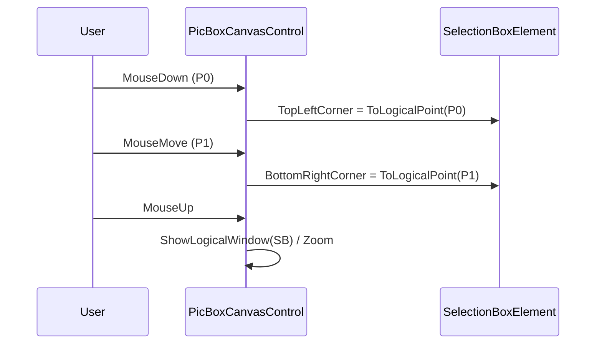

# UI Elements — SelectionBox & ZoomButton 🎯

This document documents `SelectionBoxElement` and `cZoomButton` behavior, responsibilities, and functional requirements.

Files: `SelectionBoxElement.vb`, `ZoomButton.vb`

---

## SelectionBoxElement (SelectionBoxElement.vb)

### Purpose

- Represents a user-drawn selection or zoom rectangle. Supports both click-selection (small area around a point) and drag-selection (area defined by top-left and bottom-right logical coordinates).

### Key behavior & API

- Public fields: `TopLeftCorner`, `BottomRightCorner`, `KeepAspectRatio`, `LinkedPictureBox`.
- Important properties:
  - `IsInvalid` — true when box is not yet defined.
  - `IsCreatedFromSinglePoint` — detects single-click selection (based on a small logical area around `TopLeftCorner`).
  - `CType(box As SelectionBoxElement) As RECT` — conversion operator returning the effective RECT (single-click area or full box).
- Draws itself in physical coords (uses `LinkedPictureBox.GraphicInfo.ToPhysicalRect`) and supports two visual states:
  - Single click: draw a red rectangle border
  - Area selection: draw a translucent fill and black border
- `Invalidate()` converts the selection to a physical rectangle, inflates it by 1px and calls `LinkedPictureBox.Invalidate(r)` to trigger repaint.

### Use Cases
- Click-select object: user single left-click; system creates a small logical rectangle around click and uses it to select objects or zoom.
- Drag-select to zoom: user left-drag; upon release the control calls `ShowLogicalWindow()` or zooms into the selected area.

### FRs (selected)
- FR-SB-01: `IsCreatedFromSinglePoint` must detect click-based selection using a logical area of ~15px (via `GraphicInfo.ToLogicalDimension(15.0!)`).
- FR-SB-02: `Draw()` must support `usePhysicalCoords=True` and draw accurately when invoked from OnPaint or Refresh.
- FR-SB-03: `Invalidate()` must compute the physical rect, inflate by 1px to include borders, and invalidate only that region for performance.

### Small diagram (sequence): selection by drag


---

## cZoomButton (ZoomButton.vb)

### Purpose

- Small UI helper control (toolbar-like) that is linked to a `PicBoxCanvasControl` and toggles its visual settings and click action.

### Key behavior & API

- `LinkedPictureBox` property: when set, `RefreshDisplayButtonState()` syncs toggle buttons with linked control settings.
- Button actions update `LinkedPictureBox` properties and call `Redraw()` to refresh visuals.
  - `btViewGrid` toggles `ShowGrid`
  - `btViewRulers` toggles `ShowRulers`
  - `btViewScrollBars` toggles `ShowScrollbars`
  - Unit buttons set `UnitOfMeasure` and call `Redraw()`
  - `btMeasure` / `btZoom` set `ClickAction = enClickAction.MeasureDistance/Zoom`
  - `btZoomFit` calls `LinkedPictureBox.ZoomToFit()`
  - `btLoad` opens file dialog and sets `LinkedPictureBox.Image` and `ZoomToDefaultRect()`
- `tbPixelSizeMic` triggers an InputBox to set `BackgroundImagePixelSize_Mic` and calls `Redraw(True)` to force cache rebuild.

### Use Cases

- Toggle rulers/grid/scrollbars during interactive debugging to identify alignment issues.
- Change unit of measure to switch ruler labels and measurement behavior.
- Switch interaction mode between zoom and measure.
- Load an external image into the control.

### FRs (selected)

- FR-ZB-01: `RefreshDisplayButtonState()` should reflect the current `LinkedPictureBox` state (grid, rulers, scrollbars, unit, click action).
- FR-ZB-02: UI operations must call `LinkedPictureBox.Redraw()` to ensure visual changes are applied and cached bitmaps are rebuilt when necessary (e.g., unit change, pixel size change).
- FR-ZB-03: `btLoad` must safely load supported image formats (jpg, png, tiff, gif) and call `ZoomToDefaultRect()` after loading.

### Small diagram: toggling measure mode
```mermaid
sequenceDiagram
    participant User
    participant ZB as cZoomButton
    participant Ctrl as PicBoxCanvasControl
    User->>ZB: Click(btMeasure)
    ZB->>Ctrl: Ctrl.ClickAction = MeasureDistance
    ZB->>ZB: RefreshDisplayButtonState()
    Ctrl-->>User: Visual mode changes; OnPaint displays measurement overlays
```

---

## Implementation tips
- `cZoomButton` acts as an immediate-mode UI binder; it should not contain complex logic—delegate actual behavior to the `PicBoxCanvasControl` and use `Redraw()` when state changes.
- `SelectionBoxElement` should keep logic deterministic: prefer `RectFromPoints()` for aspect-lock behavior and `SingleClickRectangle` for single-click behavior.

---
